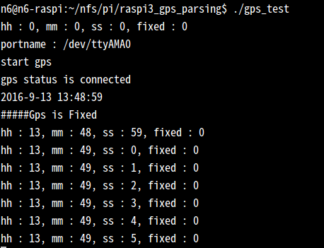

# raspi3_gps_parsing
GPS Parsing by Raspberry Pi3

Prepare
=======

 
edit config.txt
<pre>
<code>
$sudo /boot/config.txt
</code>
</pre>

  
add code as below
<pre>
<code>
#bt disabled
dtoverlay=pi3-disable-bt
</code>
</pre>

  
disable the hciuart  
and then reboot
<pre>
<code>
$sudo systemctl disable hciuart
$sudo reboot -h
</code>
</pre>

now, you can use "/dev/ttyAMA0"

git clone https://github.com/chandong83/raspi3_gps_parsing

make -j4

./gps_test

screenshot  
----------

